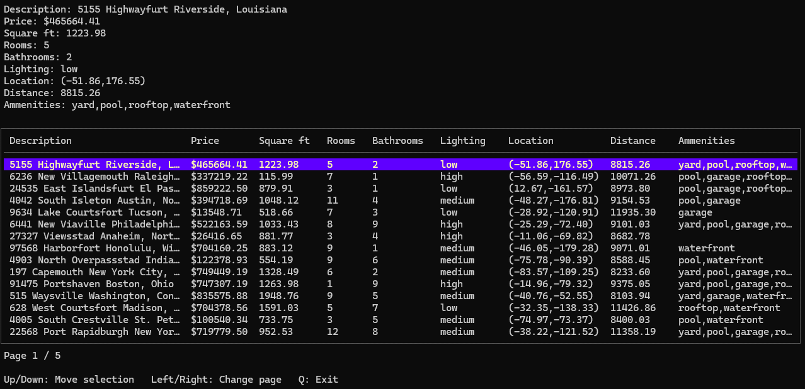

# Filter Prop App

This is a demo project for a CLI application which is capable of querying a list of real estate data and filter it using operators.



## Requirements

To run this application, the following requirements must be met:
- [Go](https://go.dev/) must be installed (version >1.24)
- A [Postgres](https://www.postgresql.org/) database must be up and running.
  - If [Docker](https://www.docker.com/) is installed, there is a script provided in this repository to start a container with a Postgres server running (more details in the section below)

## Running the application

- Download or clone this repository using `git clone https://github.com/Ta-ma/prop-filter-app.git`
- You can run the `./start_db.sh` script to start a Docker container with a Postgres database. 
  - This container will be listening for incoming connections on the port `8080`.
  - The default configuration file in this repo has the credentials and default configuration to connect to it.
- Change the default values `config.json` if needed (see the **Configuration** section).
- Open a terminal in the repository folder and run `go run main.go query`
  - Alternatively, you can install the application by running `go install`
  - Now you can run it from any terminal: `filter-prop-app query`
- If the table is not rendering properly, make sure the terminal window height and width so that it looks like the attached .gif. 
- If it still doesn't work properly you can try using the old render (see the **Configuration** section).

## Usage

When running the `query` command, it will list all entries found in the database in a table like format. The data will not be shown all at once but rather in pages (by default, it will start on page 1).

Here the user can press the **LeftArrow** and **RightArrow** keys to navigate to the previous/next page, and **UpArrow** and **DownArrow** to move the selected row. The currently selected properties details will be shown above the table. 

To exit, press **Q**.

Additionally, parameters can be passed to the `query` command to change it's behaviour, filter the data or provide additional information:

- `--page-size`, `-w`: How many entries will be shown per page. Default is 15.
- `--page`, `-n`: If specified, the command will jump to this page number directly. Default is 1. The max value allowed for this value is the amount of pages that are available to display, which depends on the page-size parameter and the amount of data in the database.

Example: `query -w 10 -n 5` will show 10 entries per page and will being by displaying data at the page number 5.

### Numerical filter parameters

Properties can be filtered by their numerical fields by using the following parameters. The value of the parameter must have the format `"<op><value>"` where:
  - `<op>`: Operator, can be `=`, `<`, `>`, `<=`, `>=`
  - `<value>`: A numerical value which must be of the type supported by the field.

For example: `query -p "<40500.50"` will list only properties with a price value below 40500.50.

The possible operators are:
- `--price`, `-p`
- `--rooms`, `-r`
- `--bathrooms`, `-b`
- `--latitude`, `-x`
- `--longitude`, `-y`
- `--sqft`, `-s`

Multiple filter parameters can be passed to the `query` command, for example `query -r ">=5" -s ">1000"` will list only properties that have at least 5 rooms and have more than 1000 sq ft. in land.

Filter expressions can also be chained to apply more than 1 filter to a single value.

Example: `query -p ">=250000.0;<=475000.0" -b "=3"` will list properties that have exactly 3 bathroos and the price is between 250000 and 475000.
  - `<op>`: Can be `=` (the field must match the value, casing ignored) or `has:` (the field must contain the value, casing ignored)
  - `<value>`: A text value which can be made of any combination of word characters (letters and numbers)

The operator can be one of the following:
- `--description`, `-d`
- `--ammenities`, `-a`: Possible values for this parameter are `yard`, `pool`, `garage`, `rooftop` or `waterfront`.
- `--lighting`, `-l`: This parameter is special in that it only allows the `=` operator, and the allowed values are `low`, `medium` or `high`

Examples:
- `query -d "has:Alaska"` will list properties that have the word "Alaska" or "alaska" in their description.
- `query -a "=yard" -l "=high"` will list properties that only have a yard as an ammenity and that have a high lighting.
- `query -d "has:south" -a "has:pool;has:garage` will list properties that have the word "south" in the description, and have at least a pool and a garage as ammenities.

### Text filter parameters

Entries can also be filtered by their text values. The format is also `"<op><value>"`, operators in this case are different but they can be chained just like the numerical filters:

### Distance parameter

Additionally, the parameter `--distance`, `-k` can be used to calculate the distance in miles between the property's location and a point given in coordinates. This new value will be shown in the table only if the parameter is present.

The usage of this parameter is `--distance "distance(x,y)"` where `x` and `y` are float point precision values.

Example: `query -k "distance(571.8,-332.94)"` will show all properties and the distance in miles between their location and the coordinates 571.8, -332.94

Properties can also be filtered by this parater using a single numerical operator and value.

Example: `query -k "distance(-61.68,10.30)<4000"` will list properties that are less than 4000 miles in distance to the coordinates -61.68, 10.30.

The calculation of the distance is an approximation being done in the database using the Haversine formula. It's not advised to use the `=` operator here as floating point values are approximated when being displayed to 2 decimals meaning it will be difficult to find an exact match to a distance.

Credits for this implementation go to Laura Moss, the details can be found [here](https://marathonus.com/about/blog/using-haversines-with-sql-to-calculate-accurate-distances/).

## Configuration

The configuration parameters are read from a `config.json` file located in the same folder where the application is being run from.

```json
{
	"DbConfig": {
		"Host": "LocalHost",
		"Port": 8080,
		"PgUser": "dbadmin",
		"PgPassword": "filterpr0p",
		"DbName": "filter-prop",
		"SeedDatabase": false,
		"SeedEntries": 30000
	},
	"Cli": {
		"TrimLength": 30,
		"UseOldRender": false
	}
}
```

### DbConfig

- `Host`: The host where the Postgres database is running.
- `Port`: Port of the Postgres server.
- `PgUser`: User of the Postgres server.
- `PgPassword`: Password of the Postgres server.
- `DbName`: Name of the database where the properties data tables are located. The specified user must have read access to this database (and permissions to create tables and functions if SeedDatabase is true)
- `SeedDatabase`: If true, when the query command is run it will automatically create the required functions and tables and populate them with mock data.
- `SeedEntries`: If `SeedDatabase` is true, the amount of entries that will be generated in the properties database.

### Cli

- `TrimLength`: (only if UseOldRender is true) The values in columns `Description` and `Ammenities` will be trimmed if they exceed the length specified by this value. If 0, the values won't be trimmed.
- `UseOldRender`: Renders the table using Go's TableWriter instead of BubbleTea. This version is more limited in features but might be useful if the terminal is not able to work properly with BubbleTea.

### Tools and dependencies

These have been vital in order for me to make this application. Big thank you to the authors of these for providing them as open source!

- [PostgreSQL](https://www.postgresql.org/)
- [Cobra](https://github.com/spf13/cobra)
- [GORM](https://gorm.io/)
- [gofakeit](https://github.com/brianvoe/gofakeit)
- [Testify](https://github.com/stretchr/testify)
- [Bubble Tea](https://github.com/charmbracelet/bubbletea)
- [Bubbles](https://github.com/charmbracelet/bubbles)
- [Lip Gloss](https://github.com/charmbracelet/lipgloss)
